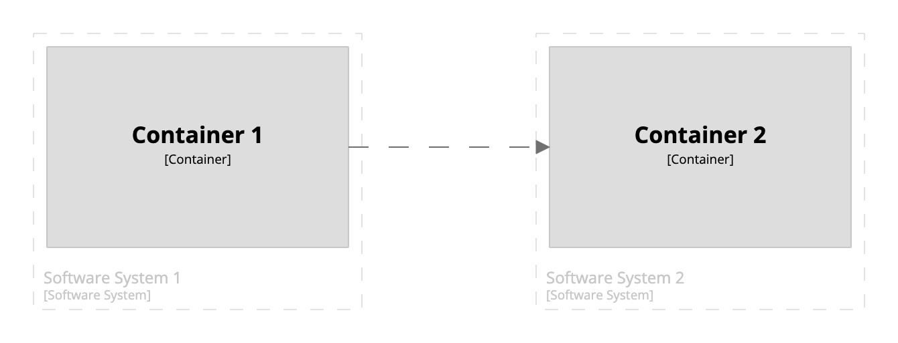

# Container view (for multiple software systems)

By default, the `include *` statement, when used inside a container view definition, will include all of the containers
inside the software system in scope, along with any external software system dependencies.
For example, the following DSL will generate the diagram below.

```
workspace {

    model {
        s1 = softwareSystem "Software System 1" {
            c1 = container "Container 1"
        }

        s2 = softwareSystem "Software System 2" {
            c2 = container "Container 2"
        }
        
        c1 -> c2
    }

    views {
        container s1 {
            include *
            autoLayout lr
        }
    }
    
}
```

[](https://structurizr.com/dsl?src=https://docs.structurizr.com/dsl/cookbook/container-view-for-multiple-software-systems/example-1.dsl)

While sufficient for many purposes, there may be times when you want to show the dependency between the two containers, each of which resides in a
separate software system.
To do this, you can modify the `include` statement, as shown in the example below.

```
workspace {

    model {
        s1 = softwareSystem "Software System 1" {
            c1 = container "Container 1"
        }

        s2 = softwareSystem "Software System 2" {
            c2 = container "Container 2"
        }
        
        c1 -> c2
    }

    views {
        container s1 {
            include c1 c2
            autoLayout lr
        }
    }

}
```

This in turn will now show the two containers.

[](https://structurizr.com/dsl?src=https://docs.structurizr.com/dsl/cookbook/container-view-for-multiple-software-systems/example-2.dsl)

If you'd rather not specify each container individually, you could utilise an [expression](/dsl/language#expressions)
and replace the `include` statement with one of the following:

- `include element.type==container`
- `include element.parent==s1 element.parent==s2`

## Links

- [DSL language reference - container](/dsl/language#container-view)
- [DSL language reference - Expressions](/dsl/language#expressions)