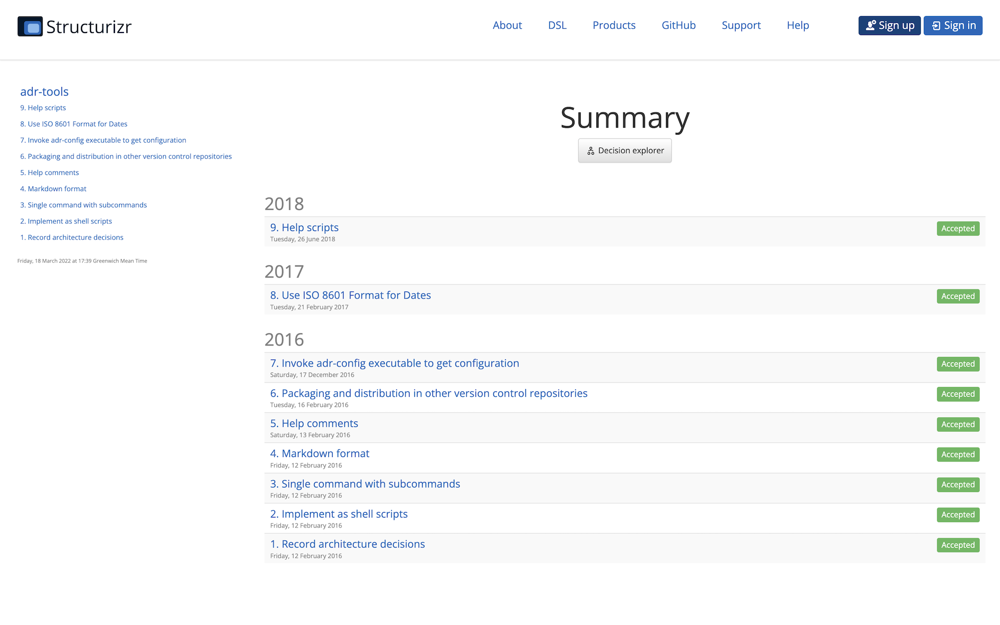
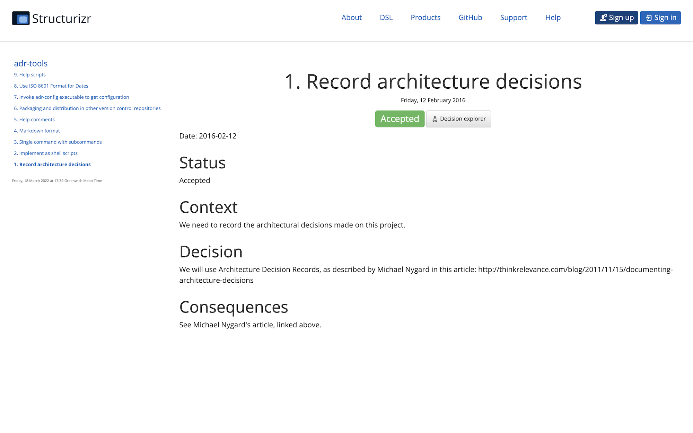

# Decisions

Because diagrams alone can't express the decisions that led to a solution, Structurizr allows you to supplement your
software architecture model with a decision log, captured as a collection of lightweight Architecture Decision Records (ADRs)
[as described by Michael Nygard](https://cognitect.com/blog/2011/11/15/documenting-architecture-decisions),
and featured on the [ThoughtWorks Technology Radar](https://www.thoughtworks.com/radar/techniques/lightweight-architecture-decision-records).
Structurizr allows you to publish your ADRs to allow team members get an "at a glance" view of the current set of ADRs, along with facilities to make navigating them easier.

[](https://structurizr.com/share/39459/decisions)

[](https://structurizr.com/share/39459/decisions/adr-tools#1)

In Structurizr, each ADR has an ID, title, date and status (e.g. "Proposed", "Accepted", "Superseded", etc),
along with unstructured content written using Markdown or AsciiDoc. ADRs can either be created manually,
or imported from tools like [adr-tools](https://github.com/npryce/adr-tools).

## Navigation

To navigate through the ADRs, you can either use the navigation on the left of the page,
the `Left` and `Right` cursor keys, or the quick navigation dialog, which is accessed by pressing the `Space` key.

## Decision explorer

You can use the  button to open a force-directed graph that shows the connections between decisions. Double-click a decision to view it.

## Customizing decision status labels

To customize the colour used to render decision statuses,
just add an element style to your workspace with a tag of the form `Decision:Status` (where Status is the status label).
For example, if you're using the DSL and want to render a decision status of "Adopted" as green:

```
element "Decision:Adopted" {
    colour white
    background #5cb85c
}
```