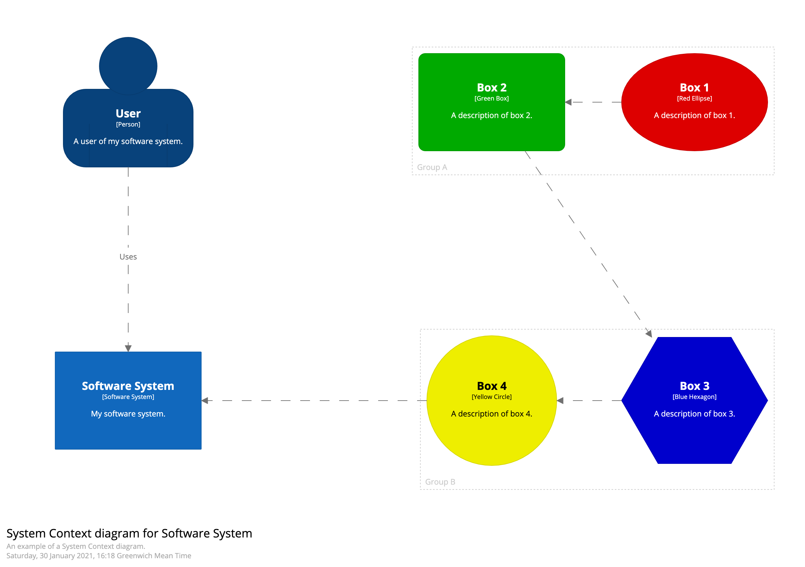
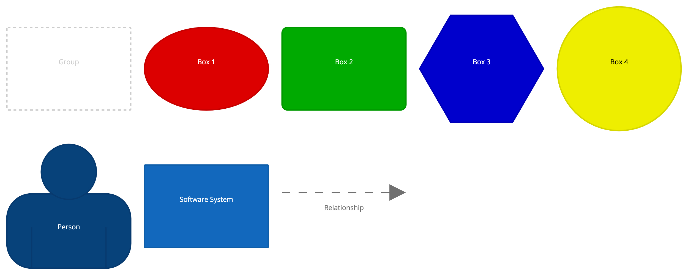

# Custom view

In addition to the C4 model diagrams, Structurizr provides support for creating ad hoc diagrams, using custom elements,
based upon the same diagramming infrastructure.

## Custom elements

Structurizr's C4 model implementation has well-defined semantics and rules
(e.g. you can't add components to a System Context view), which works for most use cases. But there are times when
you might want to do something a little different, and not be restricted by these rules. For example,
perhaps you want to show how users have access to deployment nodes, or that your software system is used by piece of
hardware. For this reason, you can define your own custom model elements, and apply whatever semantics you like through
the existing visual styling mechanism of tags and styles.

Custom elements reside at the top level of the model only (there's no support for creating hierarchies of custom elements),
and they can be included on any diagram. Custom elements can have a name, type, and description. Since custom
elements use the existing tagging and styling mechanism, any custom elements used on a diagram will be automatically
included on your diagram key/legend. Custom elements can also be used on custom diagrams.

